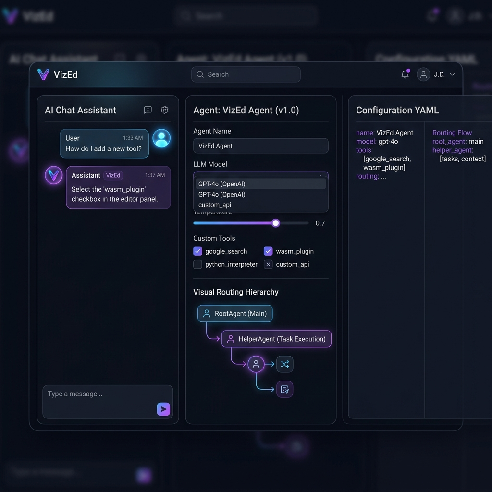

# VizEd — Visual Agent Editor & AI Architect

VizEd is a client-side-only Progressive Web App (PWA) designed to visually draft, configure, orchestrate, and deploy agent pipelines for the Go-based **[Agentic Framework](https://github.com/innomon/agentic)**.

Featuring secure **Bring Your Own Key (BYOK)** API integrations, an **interactive AI Chat Architect**, a **dual Visual-YAML editor with bidirectional synchronization**, and a **dynamic routing topology visualizer**, VizEd makes building complex multi-agent systems incredibly fast and easy.

---

## 🎨 Workspace Preview

The dashboard implements a sleek **Obsidian Glass** dark-theme with glowing neon accents, responsive card containers, and direct visual trees:



---

## 🚀 Key Features

*   **100% Client-Side Private Storage:** No backend servers, databases, or intermediary trackers. Your private keys, connection strings, chat histories, and agent configurations are preserved strictly in your browser's local sandbox (`localStorage`).
*   **Multi-Provider BYOK Settings:** secured via your own API credentials. Supports **Google Gemini**, **OpenAI**, or local **Ollama** models running on your machine.
*   **Dynamic API Model Downloader:** Automatically retrieves and populates the model selector dropdown in real-time straight from your provider's official model list, with defensive offline list fallbacks.
*   **Generative AI Chat Architect:** Talk to the builder in plain English (e.g. *"Design an organic farming advisor with a Postgres memory database and a product recommendation sequential orchestrator"*). The assistant instantly drafts, refines, and synchronizes the configuration.
*   **High-Fidelity Visual Form Editors:**
    *   **Globals Deck:** Configure default model pointers, database-backed `Session` and `Memory` connections, JWT public keys (`Auth`), and top-level launch flags (`console`, `webui`, `openclaw`, `a2a`).
    *   **Models Registry:** Register model providers, custom local model paths (`.gguf`), threads, and base URL overrides.
    *   **Dynamic Parameter Tool Builder:** Create custom tools, select argument JSON types (`string`, `number`, `boolean`, `array`, `object`), and mark whether fields are required.
    *   **Advanced Agent Orchestrators:** Select distinct agent classes (`llm`, `routing`, `sequential`, `parallel`, `loop`, `wasm`) to dynamically unlock type-specific fields like **Max Loop Iterations**, **WASM Plugin Paths**, **MCP Toolsets**, and visual **Role-Based Routing Maps**.
*   **Bidirectional Synchronization:** Real-time bi-directional link. Editing cards updates the YAML; modifying text in the editor instantly rebuilds cards.
*   **Offline PWA Capacity:** Installable standalone shell powered by service workers that caches static elements, layouts, and libraries for fast, offline operation.

---

## 🛠️ Getting Started

### 1. Run the Local Server
Since VizEd is client-side only, you can serve it locally using a single command:

```bash
cd vized
npm run start
```
This boots up a fast static server at **`http://localhost:3000`**.

### 2. Standalone App Installation
To run VizEd as a dedicated desktop or mobile application:
1. Open `http://localhost:3000` in any modern browser.
2. In your browser's address bar, click the **Install App** icon (or select "Add to Home Screen" on mobile) to save VizEd as a standalone desktop utility.
3. The app is now available in your launcher and loads instantly even without an internet connection.

### 3. API & BYOK Credentials Setup
To use the AI Chat Architect:
1. Click the **BYOK Settings** button (key icon) in the top navbar.
2. Choose your preferred **API Provider** (Gemini, OpenAI, or Ollama).
3. If you switch to Ollama, it pre-populates `http://localhost:11434/v1` as the base URL. If you select OpenAI, it lists the official completions endpoint.
4. Input your **API Key** (optional for local Ollama).
5. Click the **Fetch models from API** refresh button right next to the select dropdown. It queries your endpoint and populates the list with available models.
6. Click **Save Settings** to lock in your private dashboard configuration.

---

## 🔗 Integrating with the Go Framework

Once you have visually refined your agent chain and checked the **Config Valid** indicator, you are ready to export and deploy:

1.  Click **Download YAML** in the top navbar to save your pristine file.
2.  Copy or move the exported config straight to your **[Agentic Project Repository](https://github.com/innomon/agentic)**:
    ```bash
    mv ~/Downloads/default_agent.yaml ../agentic/config/agent.yaml
    ```
3.  Execute your agent pipeline using the Go framework launcher:
    ```bash
    cd ../agentic
    ./agentic -console config/agent.yaml
    ```

---

## 📐 Framework Schema Support Reference

VizEd maps 100% to the Go Agentic framework capabilities:

| YAML Key | Visual Form Section | Description |
| :--- | :--- | :--- |
| `root_agent` | Global Framework Settings | Declares the default entrypoint agent node. |
| `console` / `webui` | Global Framework Settings | Launcher configurations to boot Go sublaunchers. |
| `models` | Model Registry Card Grid | Maps model providers (`gemini`, `openai`, `ollama`, `ml`) to IDs. |
| `tools` | Tools Registry Card Grid | Registers WebAssembly plugins, DB models, or custom parameter fields. |
| `session` / `memory` | Global Framework Settings | Configures long-term conversation storage. |
| `agents` | Agent Pipelines Card Deck | Cards representing agents. Toggles form widgets dynamically based on the selected type (`llm`, `routing`, `sequential`, `parallel`, `loop`, `wasm`). |
| `mcp_toolsets` | Agent Cards | Connects LLM agents to external Model Context Protocol servers. |
| `role_routes` | Agent Routing Cards | Associates specific user roles directly to target agent nodes. |
