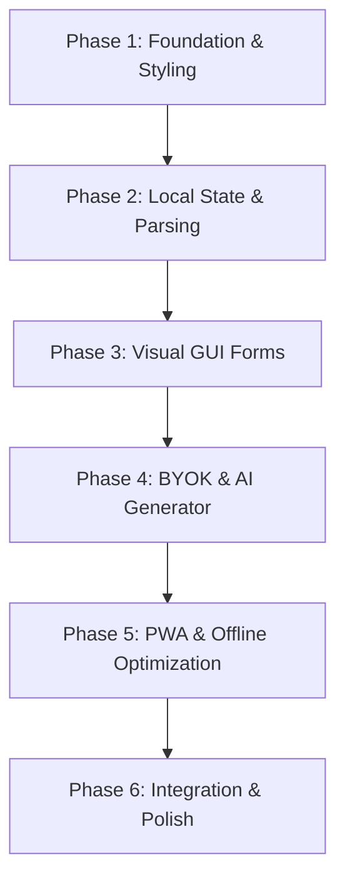

# Visual Agent Editor (VizEd) — Specs & Plan

VizEd is a client-side-only Progressive Web App (PWA) designed to visually create, edit, manage, and export agentic configuration files (`agent.yaml` / `config.yaml`) for the Go-based Agentic framework. It includes an interactive AI chat assistant that generates agent architectures on-the-fly using the user's local API credentials (Bring Your Own Key - BYOK) supporting Google Gemini, OpenAI, or local Ollama servers.

---

## 1. Technical Specifications

### Architecture & Tech Stack
*   **Paradigm:** Single-page client-side application, fully functional without any backend server.
*   **PWA Core:** Offline capability via Service Worker, `manifest.json` for installation, standalone desktop/mobile shell.
*   **UI/UX Engine:**
    *   **Markup:** HTML5 semantic structure.
    *   **Styling:** Custom modern CSS (no framework dependencies). Featuring dark glassmorphism, glowing accents, Outfit/Inter typography, animated transitions, responsive grid/flexbox layouts.
    *   **Interactivity:** Vanilla ES6+ JavaScript, leveraging Web Components or modular state listeners.
*   **Third-Party Libraries (CDN-loaded):**
    *   `js-yaml` (v4.x): For high-fidelity bidirectional parsing and serialization between YAML and JSON.
    *   `marked` (v4.x): For rendering markdown in the AI chat bubble responses.

### Key Features
1.  **Bring Your Own Key (BYOK):**
    *   Securely prompts the user for their preferred provider credentials: **Google Gemini**, **OpenAI**, or **Local Ollama**.
    *   Provides custom API base URL overrides for running local endpoints or customized API gateways.
    *   Stores keys and settings locally in `localStorage` (strictly client-side).
    *   Direct client-to-API communication with Gemini, OpenAI, or Ollama, bypassing intermediary server proxies.
2.  **Generative AI Chat Assistant:**
    *   Accepts natural language descriptions of the user's agentic use case.
    *   Leverages the selected model (e.g. `gemini-2.5-flash`, `gpt-4o`, `llama3.2`) to construct a complete, validated `agent.yaml` config matching the framework's schema.
    *   Maintains recent context history, allowing iterative prompting (e.g., "Add a search tool to the HelperAgent", "Configure postgres memory").
3.  **Visual Configuration Designer:**
    *   **Global Parameters:** Edit `root_agent`, configure `session` database options, `memory` providers, and `auth` credentials.
    *   **Models Registry:** Create/edit LLM configurations with providers (`gemini`, `openai`, `ollama`, `ml`), custom URLs, keys, and defaults.
    *   **Tools Catalog:** Manage framework tools (`builtin`, `gemini`, `sandbox`, `userdb`, `wasm`, `logic_query`) with form-based parameters.
    *   **Agents Architect:** Card-based builder for defining agents, selecting models, writing system instructions, checking tools, and declaring sub-agent hierarchy.
    *   **Visual Topology Graph:** Interactive visual representation of the agent routing structure (Root agent → Sub-agents) using CSS Flex/Grid trees.
4.  **YAML Text Editor & Preview:**
    *   Side-by-side or split layout showing real-time formatted YAML output.
    *   Direct text editing with automatic validation.
5.  **Bidirectional Synchronization:**
    *   Editing in the Visual Designer updates the YAML code pane.
    *   Modifying the text in the YAML editor automatically parses and syncs back to the Visual Designer GUI (if syntax is valid; otherwise displays a friendly validation alert).
6.  **Local Project Persistence:**
    *   Saves agent project profiles, chat histories, and configurations directly inside IndexedDB or LocalStorage.
    *   Allows creating multiple projects, duplicating existing ones, and viewing version history.

---

## 2. Framework Schema Reference

To ensure strict compliance with `../agentic`, VizEd targets the following YAML schema:

```yaml
root_agent: [string - entrypoint agent]

models:
  [model_name]:
    provider: [gemini | openai | ollama | ml]
    model_id: [string]
    default: [boolean]
    api_key: [string, optional]
    base_url: [string, optional]
    model_path: [string, optional]
    threads: [number, optional]

session: # optional
  provider: [database | inmemory | gnogent | vertexai]
  driver: [postgres | sqlite, etc.]
  dsn: [string]
  auto_migrate: [boolean]

memory: # optional
  provider: [database | inmemory | gnogent | prolog]
  driver: [postgres | sqlite, etc.]
  dsn: [string]
  auto_migrate: [boolean]

auth: # optional
  jwt:
    public_key_path: [string]
    issuer: [string]
    audience: [string]

tools:
  [tool_name]:
    type: [builtin | gemini | sandbox | userdb | wasm | logic_query]
    description: [string]
    parameters: # key-value pair of schema
      [param_name]: {type: [string|number|boolean], required: [boolean]}
    # optional type-specific fields:
    tool: [string - e.g. google_search for gemini]
    op: [string - for userdb profile operations]
    db: {driver: [string], dsn: [string]}
    module_path: [string - for wasm]
    security: {allowed_paths: [list], allowed_domains: [list]}
    kb_path: [string - for logic_query]

agents:
  [agent_name]:
    description: [string]
    model: [string - model reference]
    instruction: |
      [multiline string - system prompt]
    tools: [list of strings - tool references]
    sub_agents: [list of strings - agent references]
    mcp_toolsets:
      - endpoint: [string]
```

---

## 3. Implementation Plan



### Phase 1: Foundation & Styling
*   Create directory structure and initialize files: `index.html`, `index.css`, `app.js`, `manifest.json`, `sw.js`.
*   Establish the premium visual design system in `index.css`:
    *   Dark slate & obsidian colors (`#0b0f19`, `#121826`, `#1e293b`).
    *   Vibrant gradient glows (neon purple, indigo, cyan: `linear-gradient(135deg, #6366f1, #3b82f6, #06b6d4)`).
    *   Glassmorphic panels (`backdrop-filter: blur(16px)`).
    *   Responsive columns: Left (Chat Assistant), Center/Right (Workspace with Visual Editor / YAML Editor tabs).

### Phase 2: Local State & Bidirectional YAML Sync
*   Load CDN scripts safely: `js-yaml` and `marked`.
*   Implement `app.js` core state container representing the config state.
*   Write `updateYamlFromState()`: serializes current state to pristine YAML.
*   Write `updateStateFromYaml()`: parses user-edited YAML text, validates it, and updates the reactive visual structures.

### Phase 3: Visual GUI Editor
*   Create visual form sections with tabbed navigation:
    *   **Globals Tab:** Root agent dropdown, Session DB, Memory DB, Auth.
    *   **Models Tab:** Grid of cards representing models with inputs, default flags, and "Add Model" action.
    *   **Tools Tab:** Registry of custom tools with dynamic parameter listing (Key, Type, Required).
    *   **Agents Tab:** Dynamic list of agents. Each agent card shows inputs, a multiline instructions box, and dropdowns/checkboxes to easily select which model it uses, which tools it has, and which sub-agents it forwards to.
    *   **Topology Tab:** Generates an auto-updating node diagram showing the routing hierarchy.

### Phase 4: BYOK & AI Chat Assistant
*   Create a "BYOK Settings" modal supporting Gemini, OpenAI, and Ollama.
*   Implement dynamic lists of pre-populated models, along with text inputs for entering custom model names.
*   Implement the chat interface: auto-scrolling feed, friendly AI agent greeting, and quick-prompt chips (e.g., "Farmer Advisor", "Med-FHIR Auditor", "Web Search Assistant").
*   Implement client-side fetch router in `app.js` that checks selected providers, handles key validations, and coordinates either Gemini's Content Generation API or OpenAI/Ollama Chat Completions APIs (`/chat/completions`) directly.
*   Write custom chat parsing: when the model outputs a code block containing YAML, extract it, and render an "Apply Generated Config to Editor" button that loads it directly into the state and visual components.

### Phase 5: PWA & Offline Support
*   Generate `manifest.json` with app icons, startup themes, and installation rules.
*   Write a service worker `sw.js` that pre-caches index files, local CSS/JS, and Google Fonts so the entire UI loads instantly offline.
*   Provide an install button in the app topbar.

### Phase 6: Final Verification & Launch
*   Implement project exporting (direct download of `.yaml`, copying to clipboard).
*   Test with complex configurations (multi-agent structures, custom tools, databases).
*   Write user manual and developer guide.
